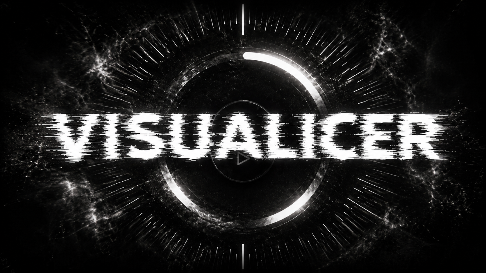

# VISUALICER

A local-first lyric and audio visualizer. Press play, a ring tracks the song, and timed lyrics rise and fall with it. The name is a play on mine: ICE.



**Live:** [lyric-audio-visualizer.vercel.app](https://lyric-audio-visualizer.vercel.app)

## Features

- Plays local audio with artwork, a background image, and lyrics or SRT captions
- Circular and horizontal seeking by mouse, touch or keyboard
- 16 themes, each with its own dark and light palette
- Separate title, UI and lyric fonts from a hand-picked catalog
- Adjustable ring strokes, layout, metadata and time display
- Remembers your settings in the browser

Nothing you load leaves your device. There are no uploads, accounts or servers.

## Part of SSS

VISUALICER also ships inside [SSS](https://github.com/iice257/TikTok-Lyric-Video-Pipeline), my lyric-video pipeline. There its 16 themes double as the render presets, so a video comes out in the same colors and fonts you see here.

## Run locally

```bash
npm install
npm run dev
```

Built with Next.js. By [ICE](https://github.com/iice257).
